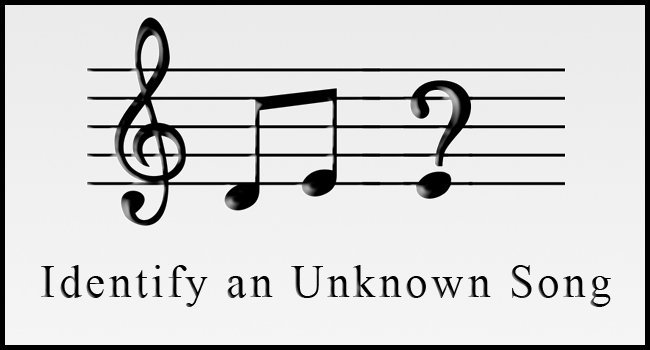

# Applied Data Science @ Columbia
## Fall 2019
## Project 1: A "data story" on the songs of our times



### [Project Description](doc/)
This is the first and only *individual* (as opposed to *team*) this semester. 

Term: Spring 2020

+ Projec title: How to Recognize the Genre?
                if you know little English and rarely liston to songs?
+ This project is conducted by Zhongtian Pan

+ Project summary: This project wants to explore some methods and strategy to recognize the genre of a song. It is more like a game: if you know little English and rarely listen to songs, how can you tell the genre of a song randomly picked from the data? We will analyze the percentage, tempo, and key words of different genres to see if we can win this game.

Following [suggestions](http://nicercode.github.io/blog/2013-04-05-projects/) by [RICH FITZJOHN](http://nicercode.github.io/about/#Team) (@richfitz). This folder is orgarnized as follows.

```
proj/
├── lib/
├── data/
├── doc/
├── figs/
└── output/
```

Please see each subfolder for a README file.
